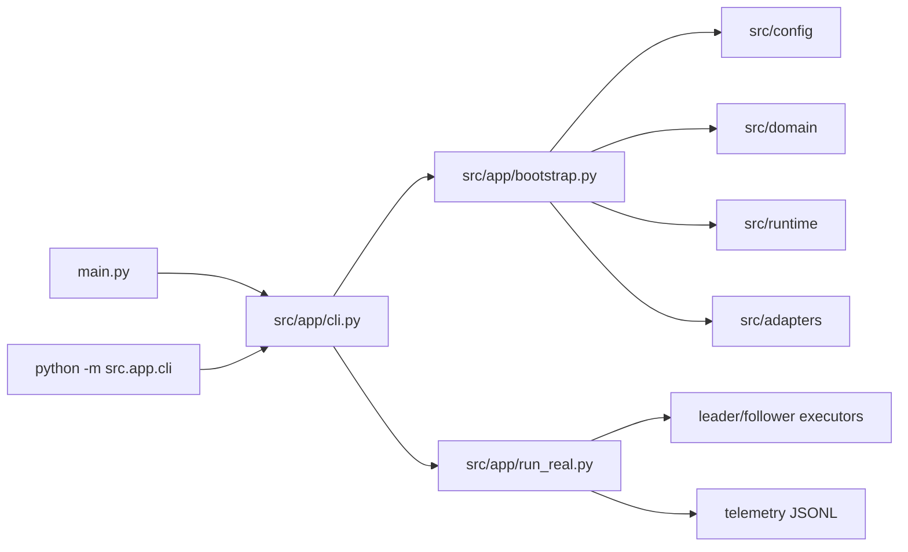

# Project Map

This repository is a real-hardware Crazyflie AFC swarm experiment baseline. Its main job is to turn YAML configuration into domain models, runtime control objects, cflib hardware adapters, and finally a real mission loop that records structured telemetry for later replay and comparison.

The project can feel large because it keeps several product surfaces in one tree: real-flight execution, offline simulation, ROS2/Crazyswarm integration, telemetry analysis, web browsing of artifacts, ablation scripts, and compatibility tests.

## Main Startup Path

The real-flight path is the primary path to understand first:



Typical real mission command:

```bash
python -m src.app.cli run
```

`main.py` is only a compatibility wrapper. The maintained entry point is `src/app/cli.py`.

## Directory Responsibilities

| Path | Role | How to read it |
| --- | --- | --- |
| `config/` | YAML runtime inputs for fleet, mission, communication, safety, and startup mode. | Read with `src/config/loader.py`; these files define the current behavior more reliably than older notes. |
| `src/config/` | Loads and validates YAML into structured app config. | `loader.py` is the entry; `schema.py` explains the supported fields. |
| `src/domain/` | Hardware-independent math and mission concepts: fleet, formation, stress matrix, AFC model, mission profile, leader/follower references. | This is the cleanest layer for understanding the control problem. |
| `src/runtime/` | Mission runtime primitives: pose bus, affine frame estimation, follower controllers, scheduler, safety, telemetry, health/link buses, replay helpers. | This layer owns state and decisions, but should not know cflib details. |
| `src/adapters/` | Hardware and backend adapters: cflib link/transport, Lighthouse pose source, executors, radio driver selection, manual keyboard input, Crazyswarm sim adapters. | This layer translates runtime intent into backend-specific calls. |
| `src/app/` | Application orchestration: CLI, dependency assembly, real mission loop, preflight, offline analysis, simulation entry points, web command. | Start with `cli.py`, `bootstrap.py`, then `run_real.py`. |
| `src/web/` | Local offline web viewer for telemetry and artifacts. | Support surface, not needed for first-pass flight understanding. |
| `scripts/` | Offline sweep, ablation, and maintenance scripts. | Some are tested and should be treated as maintained tools; others look like local maintenance helpers. |
| `src/tests/` | Contract and regression tests. | Historical script-style tests coexist with normal pytest tests through `src/tests/conftest.py`. |
| `telemetry/` | Real mission JSONL logs. | Runtime output, not source. |
| `artifacts/` | Derived plots, summaries, and analysis outputs. | Generated output, not core source. |

## Command Surfaces

`src/app/cli.py` currently exposes several different jobs through one parser:

| Command | Purpose | Core or support |
| --- | --- | --- |
| `run` | Real hardware mission. | Core |
| `budget` | Trajectory memory budget dry-run. | Support |
| `replay` | Summarize telemetry JSONL. | Support |
| `viz` | Generate offline reference visualizations. | Support |
| `compare` | Compare one run against ideal trajectory. | Support |
| `compare-runs` | Compare multiple runs and regression thresholds. | Support |
| `sim` | Minimal offline control-chain smoke test. | Support |
| `ros2-sim` | WSL Crazyswarm2/crazyflie_sim backend task. | Support |
| `probe-full-state` | Single-drone full-state/Mellinger probe. | Support / diagnostic |
| `web` | Local telemetry/artifact browser. | Support |

The CLI is broad, but most commands are not part of the real-flight control path.

## Core Runtime Object Graph

`src/app/bootstrap.py` is the composition root:

1. `ConfigLoader.load()` reads `config/`.
2. `FleetModel`, `FormationModel`, `StressMatrixSolver`, `AFCModel`, and mission/reference generators build the domain layer.
3. `PoseBus`, `AffineFrameEstimator`, follower controller, `MissionFSM`, `SafetyManager`, `CommandScheduler`, telemetry, and health/link buses build the runtime layer.
4. `build_real_app()` adds cflib adapters, command transport, executors, Lighthouse pose source, console tap, and optional keyboard manual input.
5. `RealMissionApp` in `src/app/run_real.py` starts the hardware flow and runs the mission loop.

## What Is Core

For real-flight behavior, treat these as the first-class core:

- `config/fleet.yaml`
- `config/mission.yaml`
- `config/comm.yaml`
- `config/safety.yaml`
- `config/startup.yaml`
- `src/app/cli.py`
- `src/app/bootstrap.py`
- `src/app/run_real.py`
- `src/app/preflight.py`
- `src/config/loader.py`
- `src/domain/*`
- `src/runtime/scheduler.py`
- `src/runtime/safety_manager.py`
- `src/runtime/pose_bus.py`
- `src/runtime/follower_controller.py`
- `src/runtime/follower_controller_v2.py`
- `src/runtime/telemetry.py`
- `src/adapters/cflib_link_manager.py`
- `src/adapters/cflib_command_transport.py`
- `src/adapters/lighthouse_pose_source.py`
- `src/adapters/leader_executor.py`
- `src/adapters/follower_executor.py`
- `src/adapters/group_executor_pool.py`

Everything else is useful, but mostly supporting infrastructure: offline analysis, simulations, local web UI, experiments, diagnostics, tests, and generated outputs.

## Recommended Reading Order

1. `README.md` for the current project intent and default operating assumptions.
2. `config/fleet.yaml`, `config/mission.yaml`, and `config/startup.yaml` to understand the default mission.
3. `src/app/cli.py` to see which command actually runs.
4. `src/app/bootstrap.py` to understand object assembly.
5. `src/config/loader.py` and `src/config/schema.py` to understand config fields.
6. `src/domain/formation_model.py`, `src/domain/stress_matrix_solver.py`, `src/domain/afc_model.py`, and reference generators to understand AFC inputs and outputs.
7. `src/runtime/scheduler.py`, `src/runtime/safety_manager.py`, and `src/runtime/telemetry.py` for runtime decisions.
8. `src/app/run_real.py` last, because it is the large orchestration class that uses all the pieces.

## Mental Model

Keep this split in mind when navigating:

- `domain` answers: what should the swarm mathematically do?
- `runtime` answers: what should the host decide right now?
- `adapters` answer: how do we talk to Crazyflie/cflib/sim backends?
- `app` answers: how do we wire and run a complete workflow?
- `scripts`, `web`, and offline app commands answer: how do we analyze, compare, or generate supporting artifacts?
